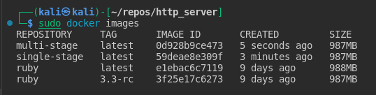

# http_server
A dead simple Ruby web server.
Serves on port 80.
/healthcheck path returns "OK"
All other paths return "Well, hello there!"

`$ ruby webserver.rb`

To demo Gitops princeples we will start from scratch.

Refer to [this repo](https://github.com/sawasy/http_server) to see the original repo before any changes are made.

## Ruby Server
First things first, you start by removing any hard coded ports like `80` to `ENV["WEB_PORT"]`.

The other changes are just extra QoL changes. 

## Docker
We then build the Dockerfile.
I tired building a single stage build and a multi stage build, and the difference it not much in size, primary because the application itself is compact.

From a security prespective it is better to go with multi stage, but i opted to go an easy route and go with a single stage for simplicity.

You can find the multi stage in extas/Dockerfile-multistage.

You can build it and use it if you want.

most important part when it comes to docker containers is make sure you use a non-root user (aka rootless container), and that is why we have

`USER app`

## Github Actions

This is considered one of my very first times of using github actions in detail, and it took me alot of time to figure things out.

Usually i am used to barebone runners where you have to download packages like wget or yq, but in GHA its all built in, which makes your pipeline compact.