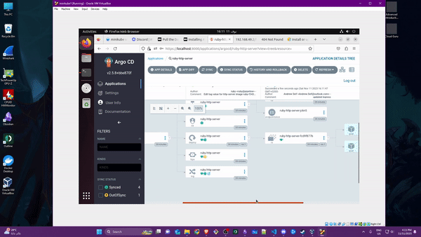

# http_server
A dead simple Ruby web server.
Serves on port 80.
/healthcheck path returns "OK"
All other paths return "Well, hello there!"

`$ ruby webserver.rb`

To demo Gitops princeples we will start from scratch.

Refer to [this repo](https://github.com/sawasy/http_server) to see the original repo before any changes are made.

## Ruby Server
First things first, you start by removing any hard coded ports like `80` to `ENV["WEB_PORT"]`. Usually, you want to keep parameter outside your code and the ports are on of these.

Second, you usually want to run different ports than 80 ..etc, to decrease attack surfaces. 

The other changes are just extra QoL changes. 

## Docker
We then build the Dockerfile.
I tired building a single stage build and a multi stage build, and the difference it not much in size, primary because the application itself is compact.

From a security prespective it is better to go with multi stage, but i opted to go an easy route and go with a single stage for simplicity.

You can find the multi stage in extas/Dockerfile-multistage.

You can build it and use it if you want.

most important part when it comes to docker containers is make sure you use a non-root user (aka rootless container), and that is why we have

`USER app`

## Workflow
Before starting let me give you a quick rundown of what we will be doing. 

Most of these concepts are applicable in a production environment unless stated otherwise. 

The flow looks like this.

1- You have your devs pushing to your source code (SC) repo.

2- Github Actions will start, and it will build your application.

3- Github will need the IAM credentials to be able to push the images to ECR hence the 
        
    `AWS_ACCESS_KEY_ID` & ` AWS_SECRET_ACCESS_KEY`
If you are wondering about the `${{ secrets.AWS_SECRET_ACCESS_KEY }}` or any `secrets.object`, it means that i am keeping that secret safe in Github action secrets intead of putting in the pipeline.

4- Github actions push the image to ECR.

5- Github actions push the image tag to helm chart in (and here comes an interesting part), in our current example, it pushes to this repo, and THIS IS NOT RECOMMENDED for production environments. 

Usually in a production env you want to either push to a DIFFERENT BRANCH or a DIFFERENT REPO altogether, to enforce seperation of concerns.

HOWEVER, in our simple example I opted for a simple solution to keep everything in the same branch but ill be moving it out in the future.

NOTE: Keep in mind, when running like this, ArgoCD which we will discuss later will sync MULTIPLE times, when you push, when GHAs change helm image tag, and when ArgoCD pulls the images from ECR.

6-7 This is simple and straight forward ArgoCD listens on the helms repo and when image tag changes, it will pull the new tag from ECR. 

8- You will need to have a secert applied in the same namespace as your application that will let you pull images from ECR.

9- Finally you have a working GitOps. Alot can be improved but thats a start!

## Github Actions

This is considered one of my very first times of using github actions in detail, and it took me alot of time to figure things out, hence the 10 billion commits.

Usually I am used to barebone runners where you have to download packages like wget or yq, but in GHA its all built in, which makes your pipeline compact, and it is really easy and simple once you get used to it.

When your pipeline pushes to GHAs you will need to have a personal token in your piepline to allow it to perform actions.

## ECR

You will need to create an ECR, and make sure to have a life policy like this:

In my case i created a lifecycle that auto deletes all images after 1 day is elapsed since it was pushed, I dont wanna pay T_T. 

## Local K8s

Before we start with local k8s you need 3 pieces of software.

1- [Docker](https://docs.docker.com/engine/install/) or any of the recommended engines

2- [Kubectl](https://kubernetes.io/docs/tasks/tools/)

3- [Minikube](https://minikube.sigs.k8s.io/docs/start/)

After that Start minikube and make sure you have ingress and metrics server enabled.

    minikube addons enable ingress
    minikube addons enable metrics-server

You can also list  addons using 

    minikube addons list

After that you will need to deploy ArgoCD.

    kubectl create ns argocd
    kubectl apply -n argocd -f https://raw.githubusercontent.com/argoproj/argo-cd/v2.9.0/manifests/install.yaml

then port forward the argocd-server to be able to access the GUI, make sure you are in a different terminal tab for QoL.
   
    kubectl port-forward svc/argocd-server -n argocd 8000:443

When successful you will be able to see something like this.

Then run the following command to get the PW, the UN is always admin.
    
    kubectl -n argocd get secret argocd-initial-admin-secret -o jsonpath="{.data.password}" | base64 -d; echo

To config ArgoCD to listen on helm repo, you will need another access token, but after that you can start your application.

When everything is successful you will be able to click on ingress and be able to get reply for your application. 

## HA and Loadbalancing. 

I opted for 2 pods for HA, but in production the setup will be entirely different.

To ensure zero downtime you might want to use PDB, i had it here but i also had to remove it because the API was acting weird, but it is something i will add in the future.

I have also left the service as LoadBalancer, since this was deployed on a local env (on-premise simulation), you dont have a load balancer and usually you use a reverse proxy + keepalived + ingress to expose apps, which is known as the Hard Way.

Yes, Cloud LoadBalancers are they easy way.

if you deploy that helm chart locally, and perform try to get svc:lb, the external IP will be stuck at pending, because its not supported.

You will need Readiness probes to avoid sending traffic before the application starts, along with its siblings aka (liveness and Startup) aka Probe Family.

Finally you should have something like this below.

If you have any questions dont forget to reach out!